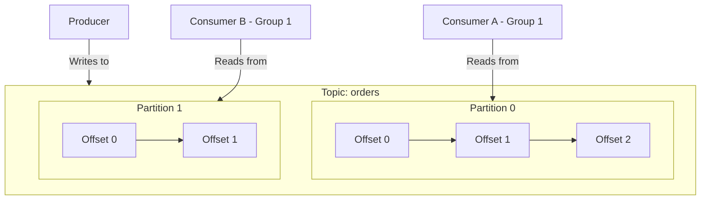
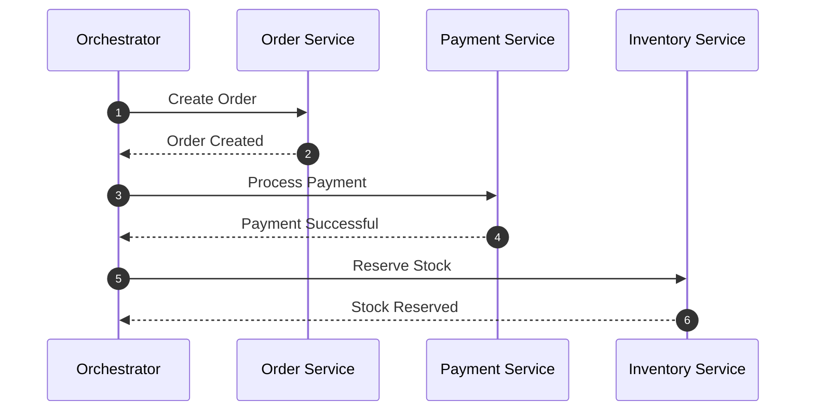
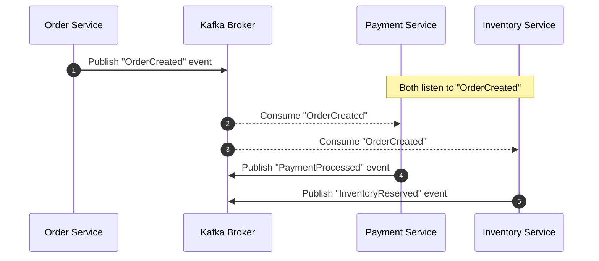

# Lesson 1: Kafka Basics & Architectural Patterns

## What is Apache Kafka?
Apache Kafka is an open-source **distributed event streaming platform**. Unlike traditional message queues (like RabbitMQ) that delete messages once they are consumed, Kafka acts as a commit log. It stores streams of records durably, in the order they occurred, allowing them to be read and replayed at any time.

> [!NOTE]
> **Core Metaphor: The Ledger**
> Think of Kafka as an append-only ledger. You can only write new entries at the end. Multiple readers can read from any point on the ledger independently without interfering with each other.

---

## Key Concepts & Terminology
Let's break down the basic building blocks of Kafka:

*   **Event/Message**: A record indicating that "something happened." It consists of a key, value, timestamp, and optional metadata headers.
*   **Broker**: A single Kafka server. A collection of brokers forms a Kafka cluster.
*   **Topic**: A logical category or feed name to which records are published. Think of it like a table in a database or a folder in a filesystem.
*   **Partition**: Topics are divided into partitions. A partition is an ordered, immutable sequence of records that is continually appended to. *Partitions are the unit of scalability in Kafka.*
*   **Offset**: A unique sequential integer assigned to each record within a partition. It acts as the record's ID.
*   **Producer**: Client applications that publish (write) events to one or more Kafka topics.
*   **Consumer**: Client applications that subscribe to (read and process) events from topics.
*   **Consumer Group**: A group of consumers working together to consume data from a topic. Kafka guarantees that each partition is consumed by only one member of a group at any given time.

### Partitioning & Scalability
Partitions allow a topic's logs to scale horizontally. By spreading partitions across multiple brokers, Kafka can handle loads larger than a single server's capacity.

---

## Event-Driven Architecture Patterns
When microservices communicate asynchronously via Kafka, two primary patterns emerge: **Orchestration** and **Choreography**. Understanding the difference is crucial for designing clean event-driven systems.

### 1. Orchestration (Command-Driven)
In an orchestration pattern, a central service (the **Orchestrator**) acts as the brain. It commands other services to perform actions and manages the overall workflow.

*   **Pros**: Clear workflow visibility in one place, easy to track states.
*   **Cons**: The Orchestrator becomes a single point of failure and a bottleneck. High coupling.

### 2. Choreography (Event-Driven)
In a choreography pattern, there is no central controller. Services publish events indicating their state changes (e.g., "OrderCreated"). Other services listen to these events and react independently.

*   **Pros**: High decoupling, highly scalable, services can react independently without knowing about other services.
*   **Cons**: Harder to visualize the global state or trace end-to-end flows. Requires distributed tracing tooling.

---

## Knowledge Check: Orchestration vs Choreography
Which communication pattern yields the tightest coupling between services?

1.  **Event Choreography**: Choreography promotes high decoupling where services only know about events, not other services.
2.  **Central Orchestration** (Correct): Orchestrators require explicit knowledge of APIs/commands of all target services, causing tighter coupling.
3.  **Topic Partitioning**: Partitioning is a horizontal scaling mechanism, not a service interaction pattern.

---

[Home →](../index.md) | [Lesson 2: Setting up Kafka (Local Cluster & Cloud) →](./0002-setting-up-kafka.md)
