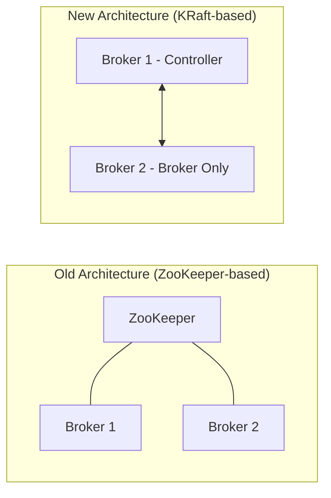

# Lesson 2: Setting up Kafka (Local Cluster & Cloud)

## Local Kafka Setup: ZooKeeper vs KRaft
Historically, Kafka required Apache ZooKeeper to manage cluster metadata, leader elections, and configurations. This introduced architectural complexity. Since Kafka 3.x (and fully production-ready in 4.x), Kafka uses **KRaft (Kafka Raft)** mode, which eliminates the need for ZooKeeper by storing metadata directly inside Kafka itself.



---

## Running Kafka Locally with Docker Compose
Here is a complete, modern `docker-compose.yml` file using the **KRaft** architecture and including **Kafka UI** for easy visualization of topics, partitions, and consumers.

```yaml
version: '3.8'
services:
  kafka:
    image: confluentinc/cp-kafka:7.6.0
    container_name: kafka-local
    ports:
      - "9092:9092"
    environment:
      # Enable KRaft mode
      KAFKA_NODE_ID: 1
      KAFKA_LISTENER_SECURITY_PROTOCOL_MAP: 'CONTROLLER:PLAINTEXT,PLAINTEXT:PLAINTEXT,PLAINTEXT_HOST:PLAINTEXT'
      KAFKA_ADVERTISED_LISTENERS: 'PLAINTEXT://kafka:29092,PLAINTEXT_HOST://localhost:9092'
      KAFKA_OFFSETS_TOPIC_REPLICATION_FACTOR: 1
      KAFKA_GROUP_INITIAL_REBALANCE_DELAY_MS: 0
      KAFKA_TRANSACTION_STATE_LOG_MIN_ISR: 1
      KAFKA_TRANSACTION_STATE_LOG_REPLICATION_FACTOR: 1
      KAFKA_PROCESS_ROLES: 'broker,controller'
      KAFKA_CONTROLLER_QUORUM_VOTERS: '1@kafka:29093'
      KAFKA_LISTENERS: 'PLAINTEXT://0.0.0.0:29092,CONTROLLER://0.0.0.0:29093,PLAINTEXT_HOST://0.0.0.0:9092'
      KAFKA_INTER_BROKER_LISTENER_NAME: 'PLAINTEXT'
      KAFKA_CONTROLLER_LISTENER_NAMES: 'CONTROLLER'
      KAFKA_LOG_DIRS: '/tmp/kraft-combined-logs'
      # Cluster ID generation (Required for KRaft)
      CLUSTER_ID: 'MkU3OEVBNTcwNTJENDM2Qk'

  kafka-ui:
    image: provectus/kafka-ui:latest
    container_name: kafka-ui
    ports:
      - "8080:8080"
    environment:
      DYNAMIC_CONFIG_ENABLED: 'true'
      KAFKA_CLUSTERS_0_NAME: local
      KAFKA_CLUSTERS_0_BOOTSTRAPSERVERS: kafka:29092
```

> [!NOTE]
> **How to Run it:**
> 1. Copy the YAML above to a file named `docker-compose.yml`.
> 2. Run `docker compose up -d` in your terminal.
> 3. Visit `http://localhost:8080` to view your topics and messages graphically.

---

## Managed Kafka Cloud Providers
In production, managing your own Kafka brokers, state stores, and OS updates can become operationally heavy. Several cloud options exist to offset this overhead:

| Provider | Pros | Cons | Best For |
| :--- | :--- | :--- | :--- |
| **Confluent Cloud** | Fully Serverless, rich ecosystem, schema registry & connectors. | Can become expensive at scale. | Enterprise applications, complex event architectures. |
| **AWS MSK** | Integrates perfectly with IAM, VPC, and AWS ecosystems. | Not truly serverless, slow provisioning/scaling. | Teams heavily invested in AWS infra. |
| **Upstash Kafka** | Serverless, pay-as-you-go per message, zero setup. | Limited features compared to Confluent. | Hobby projects, serverless functions, low-traffic apps. |
| **Aiven** | Multi-cloud, highly predictable pricing, clean UI. | Less customized tools than Confluent. | Multi-cloud strategy, simple deployment workloads. |

---

## Knowledge Check: KRaft vs ZooKeeper
What is the primary architectural improvement of KRaft over ZooKeeper in Kafka?

1.  **ZooKeeper processed messages faster**: Actually, ZooKeeper was faster at processing some simple configs, but scale limits were hit.
2.  **KRaft manages metadata natively inside Kafka brokers** (Correct): KRaft embeds cluster metadata management directly in Kafka, eliminating external dependency and metadata synchronization bottlenecks.
3.  **KRaft allows consumers to read directly from database nodes**: No, client APIs are agnostic to the metadata mechanism used by the cluster.

---

[← Lesson 1: Kafka Basics & Architectural Patterns](./0001-kafka-basics-and-patterns.md) | [Lesson 3: Java Spring Boot Integration →](./0003-spring-boot-kafka.md)
