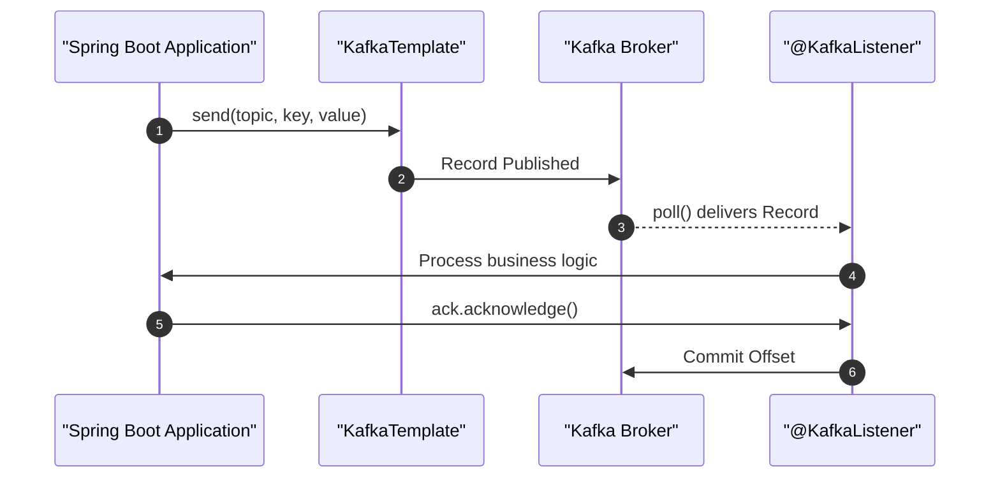

# Lesson 3: Java Spring Boot Integration

## Overview
Spring for Apache Kafka (`spring-kafka`) simplifies Kafka development by applying core Spring concepts such as templates, listener containers, and transaction managers. In this lesson, we will implement a producer and consumer with production-ready patterns, specifically focusing on **Manual Acknowledgement** to avoid data loss.



---

## 1. Project Configuration
Add the `spring-kafka` dependency to your Maven `pom.xml` or Gradle build file. Then, set up the connection parameters in `src/main/resources/application.yml`:

```yaml
spring:
  kafka:
    bootstrap-servers: localhost:9092
    producer:
      key-serializer: org.apache.kafka.common.serialization.StringSerializer
      value-serializer: org.springframework.kafka.support.serializer.JsonSerializer
      acks: all # Require confirmation from all in-sync replicas
    consumer:
      group-id: orders-group
      key-deserializer: org.apache.kafka.common.serialization.StringDeserializer
      value-deserializer: org.springframework.kafka.support.serializer.JsonDeserializer
      properties:
        spring.json.trusted.packages: "com.example.dto"
      enable-auto-commit: false # Turn off auto-commit for safer manual processing
    listener:
      ack-mode: manual_immediate
```

---

## 2. Implementing the Producer
We use `KafkaTemplate` to publish records. In a production scenario, you should publish asynchronously and handle outcomes using callbacks to log issues or update database states.

```java
package com.example.producer;

import com.example.dto.OrderEvent;
import org.springframework.kafka.core.KafkaTemplate;
import org.springframework.stereotype.Service;

@Service
public class OrderEventProducer {

    private final KafkaTemplate<String, OrderEvent> kafkaTemplate;

    public OrderEventProducer(KafkaTemplate<String, OrderEvent> kafkaTemplate) {
        this.kafkaTemplate = kafkaTemplate;
    }

    public void publishOrder(String orderId, OrderEvent event) {
        // Supplying orderId as the message key guarantees all events 
        // for this order land in the exact same partition!
        this.kafkaTemplate.send("orders-topic", orderId, event)
            .whenComplete((result, ex) -> {
                if (ex != null) {
                    // Handle write failure (e.g. queue offline, broker down)
                    System.err.printf("Failed to publish order %s: %s%n", orderId, ex.getMessage());
                } else {
                    System.out.printf("Order %s written to partition %d (Offset %d)%n",
                            orderId,
                            result.getRecordMetadata().partition(),
                            result.getRecordMetadata().offset());
                }
            });
    }
}
```

---

## 3. Implementing the Consumer (with Manual Commits)
Using `ackMode: manual_immediate` guarantees that you only commit the Kafka offset *after* your database operations or third-party API calls succeed. If they fail, the offset remains uncommitted, preventing message loss.

```java
package com.example.consumer;

import com.example.dto.OrderEvent;
import org.apache.kafka.clients.consumer.ConsumerRecord;
import org.springframework.kafka.annotation.KafkaListener;
import org.springframework.kafka.support.Acknowledgment;
import org.springframework.stereotype.Service;

@Service
public class OrderEventConsumer {

    @KafkaListener(topics = "orders-topic", groupId = "orders-group")
    public void handleOrder(ConsumerRecord<String, OrderEvent> record, Acknowledgment ack) {
        try {
            String orderId = record.key();
            OrderEvent order = record.value();
            
            System.out.printf("Consumed order %s details: %s%n", orderId, order.getStatus());
            
            // Perform business operations (e.g. database write)
            
            ack.acknowledge(); // Commit the offset back to Kafka
        } catch (Exception e) {
            System.err.printf("Error processing order record: %s. Offset not committed.%n", e.getMessage());
            // Message will be retried depending on container configuration or DLQ configuration
        }
    }
}
```

---

## 4. Java Serialization & Deserialization with Jackson 3
In Java Kafka applications, serialization translates Java objects into byte arrays for transmission, while deserialization reconstructs the original Java objects from byte arrays. 

Jackson 3.x modernizes this workflow with several key changes:
1. **Namespace Shift**: Core packages have moved from `com.fasterxml.jackson.*` to `tools.jackson.*` (with the exception of annotations like `@JsonProperty` which remain in `com.fasterxml.jackson.annotation` for backward compatibility).
2. **Immutable Builder API**: The mutable `ObjectMapper` is replaced by the immutable, thread-safe `JsonMapper`, created via a builder pattern.
3. **Unchecked Exceptions**: Methods like `readValue` and `writeValueAsString` now throw unchecked runtime exceptions, eliminating checked exception boilerplate.

### Manual Jackson 3 Serialization & Deserialization
If you want to manually serialize objects to a JSON string or byte array before sending them as a string/byte payload, use the following pattern:

```java
import tools.jackson.databind.json.JsonMapper;
import com.example.dto.OrderEvent;

public class SerializationHelper {
    // Instantiate a thread-safe, immutable JsonMapper using the builder
    private static final JsonMapper mapper = JsonMapper.builder().build();

    public static byte[] serializeEvent(OrderEvent event) {
        // writeValueAsBytes throws unchecked RuntimeException in Jackson 3
        return mapper.writeValueAsBytes(event);
    }

    public static OrderEvent deserializeEvent(byte[] bytes) {
        // readValue throws unchecked RuntimeException in Jackson 3
        return mapper.readValue(bytes, OrderEvent.class);
    }
}
```

### Custom Jackson 3 Serializer & Deserializer Classes
To register Jackson 3 directly with your Apache Kafka Producer/Consumer configuration, you can implement Kafka's `Serializer` and `Deserializer` interfaces:

```java
package com.example.serialization;

import tools.jackson.databind.json.JsonMapper;
import org.apache.kafka.common.serialization.Serializer;
import java.util.Map;

public class Jackson3Serializer<T> implements Serializer<T> {
    private final JsonMapper mapper = JsonMapper.builder().build();

    @Override
    public void configure(Map<String, ?> configs, boolean isKey) {}

    @Override
    public byte[] serialize(String topic, T data) {
        if (data == null) {
            return null;
        }
        return mapper.writeValueAsBytes(data); // Unchecked exception
    }

    @Override
    public void close() {}
}
```

```java
package com.example.serialization;

import tools.jackson.databind.json.JsonMapper;
import org.apache.kafka.common.serialization.Deserializer;
import java.util.Map;

public class Jackson3Deserializer<T> implements Deserializer<T> {
    private final JsonMapper mapper = JsonMapper.builder().build();
    private Class<T> targetType;

    public Jackson3Deserializer() {}

    public Jackson3Deserializer(Class<T> targetType) {
        this.targetType = targetType;
    }

    @SuppressWarnings("unchecked")
    @Override
    public void configure(Map<String, ?> configs, boolean isKey) {
        String typeConfig = isKey ? "key.deserializer.type" : "value.deserializer.type";
        if (configs.containsKey(typeConfig)) {
            try {
                this.targetType = (Class<T>) Class.forName((String) configs.get(typeConfig));
            } catch (ClassNotFoundException e) {
                throw new RuntimeException("Could not configure target class type", e);
            }
        }
    }

    @Override
    public T deserialize(String topic, byte[] data) {
        if (data == null) {
            return null;
        }
        if (targetType == null) {
            throw new IllegalStateException("Target type class is not configured for deserializer.");
        }
        return mapper.readValue(data, targetType); // Unchecked exception
    }

    @Override
    public void close() {}
}
```

You can then reference these custom classes in your `application.yml` or Kafka properties:
```yaml
spring:
  kafka:
    producer:
      value-serializer: com.example.serialization.Jackson3Serializer
    consumer:
      value-deserializer: com.example.serialization.Jackson3Deserializer
      properties:
        value.deserializer.type: com.example.dto.OrderEvent
```

---

## Knowledge Check: Manual Commit Safety
Why is setting `enable-auto-commit: false` preferred for production consumer services?

1.  **It increases application throughput and decreases latency**: Auto-commit actually decreases latency slightly because it does not block for commits.
2.  **It ensures offsets are only committed after successful database processing** (Correct): Auto-commit commits offsets periodically, potentially before your app finishes processing. Manual commits prevent data loss.
3.  **It enables SSL configuration between the client and broker nodes**: Auto-commit does not affect encryption; those are handled by separate security protocols.

---

[← Lesson 2: Setting up Kafka (Local Cluster & Cloud)](./0002-setting-up-kafka.md) | [Lesson 4: TypeScript with @platformatic/kafka →](./0004-typescript-kafka.md)
