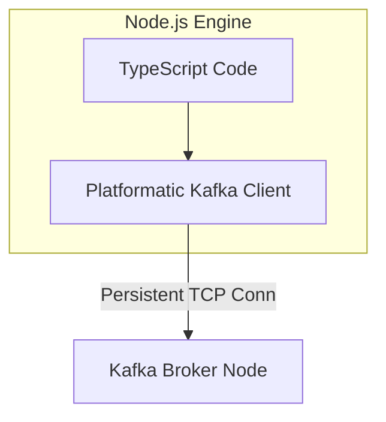

# Lesson 4: TypeScript with @platformatic/kafka

## Overview
Node.js is highly suited for event-driven systems due to its non-blocking I/O event loop. The `@platformatic/kafka` library provides a high-performance, type-safe, developer-friendly interface to build Kafka clients. In this lesson, we will set up a TypeScript producer and consumer.



---

## 1. Installation & Initialization
To begin, initialize a Node project, install TypeScript, and get the platformatic library:

```bash
npm init -y
npm install typescript @types/node ts-node --save-dev
npm install @platformatic/kafka
npx tsc --init
```

---

## 2. Creating the Producer
Let's create `producer.ts` to connect to our local cluster and dispatch messages. We use keys to route orders to specific partitions.

```typescript
import { Kafka } from '@platformatic/kafka';

// Initialize the central client manager
const kafka = new Kafka({
  brokers: ['localhost:9092'],
  clientId: 'checkout-service'
});

const producer = kafka.producer();

async function runProducer() {
  // Establish TCP connection to bootstrapping broker
  await producer.connect();
  console.log('Producer connected successfully');

  const orderPayload = {
    orderId: 'ORD-54321',
    customer: 'Jane Doe',
    total: 129.99,
    timestamp: new Date().toISOString()
  };

  try {
    await producer.send({
      topic: 'orders-topic',
      messages: [
        {
          key: orderPayload.orderId,
          value: JSON.stringify(orderPayload)
        }
      ]
    });
    console.log(`Successfully dispatched event for order: ${orderPayload.orderId}`);
  } catch (error) {
    console.error('Error dispatching message to Kafka:', error);
  } finally {
    await producer.disconnect();
  }
}

runProducer().catch(console.error);
```

---

## 3. Creating the Consumer
Now, let's build `consumer.ts`. The consumer will belong to a consumer group and handle messages sequentially within its worker loop.

```typescript
import { Kafka } from '@platformatic/kafka';

const kafka = new Kafka({
  brokers: ['localhost:9092'],
  clientId: 'inventory-processor'
});

// Configure consumer group identity
const consumer = kafka.consumer({ groupId: 'inventory-group' });

async function startConsumer() {
  await consumer.connect();
  
  // Subscribe to the desired topic from the beginning if no offsets committed yet
  await consumer.subscribe({ topic: 'orders-topic', fromBeginning: true });
  console.log('Consumer connected & subscribed to orders-topic');

  await consumer.run({
    eachMessage: async ({ topic, partition, message }) => {
      const key = message.key?.toString();
      const value = message.value?.toString();
      
      console.log(`[Partition ${partition}] Processing event: Key=${key}`);
      
      if (value) {
        const orderData = JSON.parse(value);
        // Execute business logic (e.g. reserving inventory)
        console.log(`Reserved inventory for order details:`, orderData);
      }
    }
  });
}

startConsumer().catch(console.error);
```

---

## Knowledge Check: Keys in Kafka
What is the effect of providing a consistent "key" (like orderId) when publishing events in Node/TypeScript?

1.  **It auto-encrypts the payload for security audits**: Keys do not encrypt the payload; they are part of the metadata schema.
2.  **It routes messages with the same key to the same partition** (Correct): Using a key guarantees that all messages with that same key route to the exact same partition, maintaining strict processing order.
3.  **It triggers auto-deletion of older messages from partitions**: Kafka does not use keys to auto-delete messages; durability is governed by topic retention policies.

---

[← Lesson 3: Java Spring Boot Integration](./0003-spring-boot-kafka.md) | [Lesson 5: Operations, Delivery Guarantees & Troubleshooting →](./0005-operations-and-troubleshooting.md)
