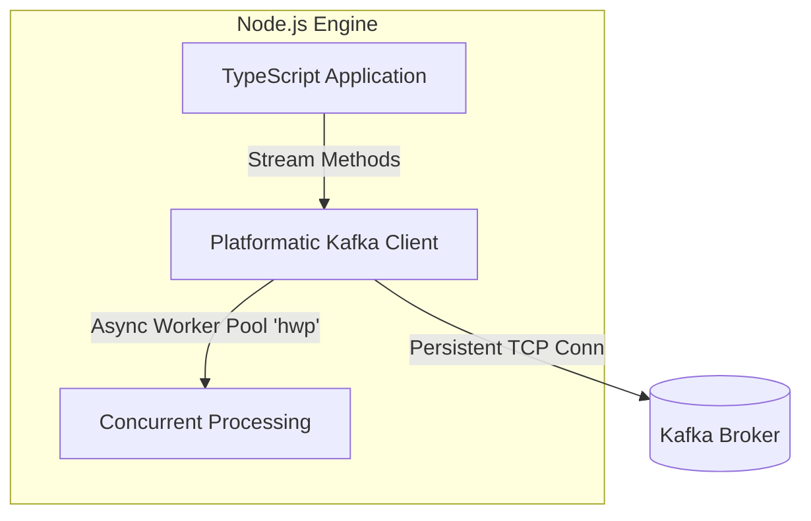

# Lesson 4: TypeScript with @platformatic/kafka

**🎯 What you will learn:**
* How to set up a high-performance Node.js Kafka client using `@platformatic/kafka`.
* Dispatching messages with partition keys to guarantee ordering.
* Consuming messages as continuous Node.js streams.
* Utilizing `hwp` for concurrent stream processing without blocking the event loop.

## Overview
Node.js is highly suited for event-driven systems due to its non-blocking I/O event loop. The `@platformatic/kafka` library provides a high-performance, type-safe, developer-friendly interface to build Kafka clients. In this lesson, we will set up a TypeScript producer and consumer.



---

## 1. Installation & Initialization
To begin, initialize a Node project, install TypeScript, the platformatic library, and the high-performance concurrent work-pool utility `hwp` (for concurrent processing):

```bash
npm init -y
npm install typescript @types/node ts-node --save-dev
npm install @platformatic/kafka hwp
npx tsc --init
```

---

## 2. Creating the Producer
Let's create `producer.ts` to connect to our local cluster and dispatch messages. We use keys to route orders to specific partitions. We import the `Producer` class directly and configure it with `stringSerializers`.

```typescript
import { Producer, stringSerializers } from '@platformatic/kafka';

// Create a producer with string serializers
const producer = new Producer({
  clientId: 'checkout-service',
  bootstrapBrokers: ['localhost:9092'],
  serializers: stringSerializers
});

async function runProducer() {
  const orderPayload = {
    orderId: 'ORD-54321',
    customer: 'Jane Doe',
    total: 129.99,
    timestamp: new Date().toISOString()
  };

  try {
    // Dispatch message with key to ensure same-key partition routing
    await producer.send({
      topic: 'orders-topic',
      messages: [
        {
          key: orderPayload.orderId,
          value: JSON.stringify(orderPayload)
        }
      ]
    });
    console.log(`Successfully dispatched event for order: ${orderPayload.orderId}`);
  } catch (error) {
    console.error('Error dispatching message to Kafka:', error);
  } finally {
    // Close the producer to release connections & resources
    await producer.close();
  }
}

runProducer().catch(console.error);
```

---

## 3. Creating the Consumer
Now, let's build `consumer.ts`. In `@platformatic/kafka`, consumption is stream-based. We import the `Consumer` class directly and configure it with `stringDeserializers` so that message payloads are read as strings rather than raw byte buffers. 

We can then consume the stream in three different ways:
1. **Event-based** (using standard EventEmitter listener).
2. **Async iterator** (sequentially iterating over messages).
3. **Concurrent processing** (handling multiple messages in parallel using `hwp`'s `forEach`).

```typescript
import { Consumer, stringDeserializers } from '@platformatic/kafka';
import { forEach } from 'hwp';

// Create a consumer with string deserializers
const consumer = new Consumer({
  groupId: 'inventory-group',
  clientId: 'inventory-processor',
  bootstrapBrokers: ['localhost:9092'],
  deserializers: stringDeserializers
});

async function startConsumer() {
  // Create a consumer stream
  const stream = await consumer.consume({
    autocommit: true,
    topics: ['orders-topic'],
    sessionTimeout: 10000,
    heartbeatInterval: 500
  });

  console.log('Consumer stream created successfully');

  // Option 1: Event-based consumption (push model)
  // stream.on('data', message => {
  //   console.log(`Received (Event): ${message.key} -> ${message.value}`);
  //   if (message.value) {
  //     const orderData = JSON.parse(message.value);
  //     console.log('Processed order (Event):', orderData.orderId);
  //   }
  // });

  // Option 2: Async iterator consumption (sequential pull model)
  // for await (const message of stream) {
  //   console.log(`Received (Iterator): ${message.key} -> ${message.value}`);
  //   if (message.value) {
  //     const orderData = JSON.parse(message.value);
  //     // Process message...
  //   }
  // }

  // Option 3: Concurrent processing (using hwp's high-performance worker pool)
  try {
    await forEach(
      stream,
      async message => {
        console.log(`Received (Concurrent): ${message.key} -> ${message.value}`);
        if (message.value) {
          const orderData = JSON.parse(message.value);
          // Process order concurrently with a set concurrency level
          console.log(`Reserved inventory for order: ${orderData.orderId}`);
        }
      },
      16 // 16 is the concurrency level
    );
  } catch (error) {
    console.error('Stream processing error:', error);
  } finally {
    // Close the consumer when done or on application shutdown
    await consumer.close();
  }
}

startConsumer().catch(console.error);
```

---

## Gotchas and Best Practices

### 1. Memory Leaks in Streams
**Gotcha:** If you consume using Node.js streams but your processing logic is slower than the ingestion rate, messages will buffer in memory until the Node.js process crashes with an OOM (Out of Memory) error.
**Fix:** Always use backpressure-aware patterns. The `hwp` library handles this automatically by pausing the underlying stream when the concurrency limit is reached.

### 2. Unhandled Promise Rejections in Worker Pools
**Gotcha:** Throwing an unhandled exception inside your stream's `forEach` or async iterator will cause the Node process to crash entirely or silently drop the consumer thread.
**Fix:** Wrap your processing logic in `try-catch` blocks. Send failed messages to a Dead Letter Queue (DLQ) rather than allowing them to crash the stream processor.

### 3. Graceful Shutdown
**Gotcha:** If the Node.js application is terminated (e.g., via SIGTERM in Kubernetes) and the consumer isn't cleanly closed, Kafka will wait for the `session.timeout.ms` before rebalancing, causing processing delays.
**Fix:** Trap termination signals (`SIGINT`, `SIGTERM`) and call `await consumer.close()` before exiting the process.

---

## Knowledge Check: Keys in Kafka
What is the effect of providing a consistent "key" (like orderId) when publishing events in Node/TypeScript?

1.  **It auto-encrypts the payload for security audits**: Keys do not encrypt the payload; they are part of the metadata schema.
2.  **It routes messages with the same key to the same partition** (Correct): Using a key guarantees that all messages with that same key route to the exact same partition, maintaining strict processing order.
3.  **It triggers auto-deletion of older messages from partitions**: Kafka does not use keys to auto-delete messages; durability is governed by topic retention policies.

---

[← Lesson 3: Java Spring Boot Integration](./0003-spring-boot-kafka.md) | [Lesson 5: Operations, Delivery Guarantees & Troubleshooting →](./0005-operations-and-troubleshooting.md)
