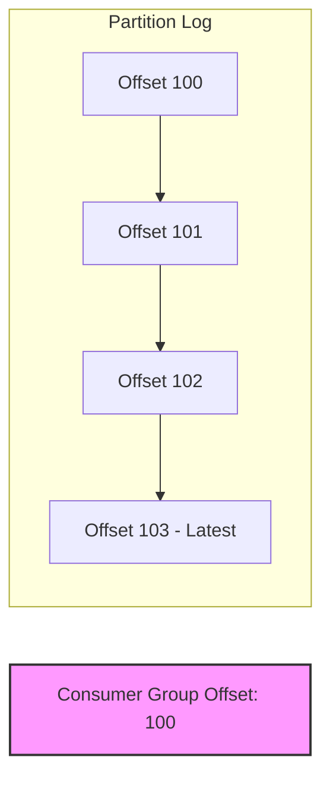
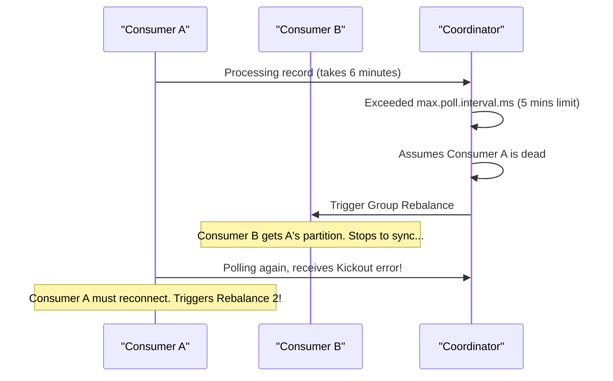

# Lesson 5: Operations, Delivery Guarantees & Troubleshooting

## 1. Delivery Guarantees in Event Streaming
In distributed systems, failures are inevitable (network cuts, node crashes, database timeouts). Kafka supports three distinct message delivery semantics depending on your configuration:

*   **At-Most-Once**: Messages may be lost but are never reprocessed. (Config: Auto-commit offsets as soon as messages are received, before processing).
*   **At-Least-Once (Industry Standard)**: Messages are never lost but may be duplicated. (Config: Manual offset commit after processing is successful, combined with producer retries).
*   **Exactly-Once Processing (EOS)**: Kafka guarantees that message processing affects downstream states exactly once. This requires Kafka Transactions and idempotent producers.

---

## 2. Managing and Mitigating Consumer Lag
**Consumer Lag** is the difference between the tail of the log (newest data produced) and the consumer group's committed offset. Lag increases when processing time per record increases, or traffic spikes.



**Remediation Strategy:**
1.  Check lag using CLI: `kafka-consumer-groups --describe`
2.  Increase topic partition count (e.g. from 4 to 8).
3.  Increase the count of consumer container instances (up to the partition count limit). Kafka cannot assign more than one consumer per partition inside a group!

---

## 3. Solving Rebalance Storms
A **rebalance** is the process where Kafka redistributes partitions among consumer group members. Rebalances halt all message consumption. A "rebalance storm" occurs when slow processing triggers a rebalance, which stops consumption, increases lag, causes other consumers to also timeout when they resume, triggering yet another rebalance!



**Mitigation Configs:**
*   **`max.poll.interval.ms`**: Increase this limit so slow consumers get more time to complete processing before being marked dead.
*   **`max.poll.records`**: Decrease the number of records pulled in a single batch (e.g. from 500 to 50) to guarantee completion within the timeout interval.

---

## 4. Handling Poison Pills & Dead Letter Queues (DLQ)
A "poison pill" is a record published to a topic that cannot be deserialized by the consumer (e.g., plain text written to a JSON topic). Standard consumers crash, restart, and retry the same record forever, blocking the partition.

**Spring Boot Remedy:** Use Spring's `ErrorHandlingDeserializer`. It catches deserialization exceptions, wraps them in a metadata payload, and passes them to the listener where it can be automatically routed to a Dead Letter Topic (DLQ).

```yaml
spring:
  kafka:
    consumer:
      # Delegate deserialization to error handlers
      key-deserializer: org.springframework.kafka.support.serializer.ErrorHandlingDeserializer
      value-deserializer: org.springframework.kafka.support.serializer.ErrorHandlingDeserializer
      properties:
        spring.deserializer.key.delegate.class: org.apache.kafka.common.serialization.StringDeserializer
        spring.deserializer.value.delegate.class: org.springframework.kafka.support.serializer.JsonDeserializer
```

---

## Knowledge Check: Mitigating Lag
If you have a topic with 4 partitions, and your consumer group has 6 active containers, how many containers will actively pull messages?

1.  **6 containers will pull messages (shared partition processing)**: No, partitions are assigned exclusively. Extra consumers stay idle.
2.  **4 containers will pull messages (2 containers will stay idle)** (Correct): A partition can only be assigned to one consumer within a group at a time. Two containers will remain idle.
3.  **0 containers will pull messages (Kafka blocks on over-provisioning)**: No, Kafka does not block the group. It assigns 4 partitions to 4 consumers.

---

[← Lesson 4: TypeScript with @platformatic/kafka](./0004-typescript-kafka.md) | [Home →](../index.md)
