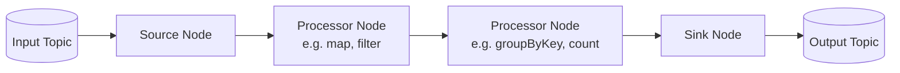

# Lesson 6: Spring for Apache Kafka Streams

**🎯 What you will learn:**

- How Kafka Streams relates to the standard Kafka Clients.
- How to construct a stream processing Topology using `StreamsBuilder`.
- The difference between `KStream` and `KTable`.
- Key gotchas like co-partitioning and state store management.

## Introduction

Apache Kafka Streams is a powerful client library for building event-driven applications and microservices, where input and output data are stored in Kafka clusters. It allows for stateful and stateless processing of event streams. Spring simplifies Kafka Streams development by managing the application lifecycle, providing auto-configuration, and integrating seamlessly with the Spring Boot ecosystem.

## Detailed Guide

### 1. Setup and Dependencies

To get started, add the `spring-kafka` dependency to your Spring Boot project.

**Maven:**

```xml
<dependency>
    <groupId>org.springframework.kafka</groupId>
    <artifactId>spring-kafka</artifactId>
</dependency>
<dependency>
    <groupId>org.apache.kafka</groupId>
    <artifactId>kafka-streams</artifactId>
</dependency>
```

### 2. Configuration

Spring Boot provides auto-configuration for Kafka Streams. You need to enable it using the `@EnableKafkaStreams` annotation and configure the necessary properties in `application.yml`.

**application.yml:**

```yaml
spring:
  kafka:
    bootstrap-servers: localhost:9092
    streams:
      application-id: my-streams-app
      properties:
        default.key.serde: org.apache.kafka.common.serialization.Serdes$StringSerde
        default.value.serde: org.apache.kafka.common.serialization.Serdes$StringSerde
        commit.interval.ms: 1000
```

### 3. Building a Topology

The core of a Kafka Streams application is the topology, which defines the stream processing logic (Sources, Processors, and Sinks). You define the topology by creating a Spring `@Bean` that takes a `StreamsBuilder` as an argument.



## Example: Word Count Application

Here is a classic word count example demonstrating stateful processing.

```java
import org.apache.kafka.common.serialization.Serdes;
import org.apache.kafka.streams.StreamsBuilder;
import org.apache.kafka.streams.kstream.Consumed;
import org.apache.kafka.streams.kstream.KStream;
import org.apache.kafka.streams.kstream.KTable;
import org.apache.kafka.streams.kstream.Produced;
import org.springframework.context.annotation.Bean;
import org.springframework.context.annotation.Configuration;
import org.springframework.kafka.annotation.EnableKafkaStreams;

import java.util.Arrays;

@Configuration
@EnableKafkaStreams
public class KafkaStreamsConfig {

    @Bean
    public KStream<String, String> kStream(StreamsBuilder streamsBuilder) {
        // 1. Read from the input topic
        KStream<String, String> stream = streamsBuilder.stream("input-topic", Consumed.with(Serdes.String(), Serdes.String()));

        // 2. Process the stream
        KTable<String, Long> wordCounts = stream
                .flatMapValues(text -> Arrays.asList(text.toLowerCase().split("\\W+")))
                .groupBy((key, word) -> word)
                .count();

        // 3. Write back to the output topic
        wordCounts.toStream().to("output-topic", Produced.with(Serdes.String(), Serdes.Long()));

        return stream;
    }
}
```

## Gotchas and Best Practices

### 1. SerDes (Serializer/Deserializer) Mismatch

**Gotcha:**

- A very common error is a `ClassCastException` or deserialization error when the data in the topic doesn't match the configured `Serde`.

**Fix:**

- Always ensure your default SerDes in `application.yml` match your most common data types. For specific steps that use different types (like the `Produced.with(Serdes.String(), Serdes.Long())` in the example), explicitly provide the correct Serde.

### 2. Co-partitioning for Joins

**Gotcha:**

- When joining two streams (`KStream-KStream` or `KStream-KTable`), they **must** be co-partitioned. This means they must have the same number of partitions and the same partitioning strategy (keys must route to the same partition number). If not, your joins will silently fail or produce incorrect results.

**Fix:**

- Verify topic configurations before running joins. If they aren't co-partitioned, you might need to re-key and write one of the streams to a new topic (using `through()`) with the correct partition count.

### 3. State Store Disk Usage

**Gotcha:**

- Stateful operations (like `count()`, `aggregate()`, `join()`) use RocksDB locally. Over time, these local state stores can consume significant disk space.

**Fix:**

- Monitor disk usage. Ensure `state.dir` is mapped to a disk with enough capacity. Use Kafka topic retention policies on the internal changelog topics to manage the size of the state backups.

### 4. Exactly-Once Semantics (EOS)

**Gotcha:**

- By default, Kafka Streams provides "at-least-once" processing, meaning duplicates can occur during failures.

**Fix:**

- If your application requires strict accuracy (e.g., financial transactions), enable EOS in your `application.yml`:

```yaml
spring.kafka.streams.properties.processing.guarantee: exactly_once_v2
```

Note that EOS has a slight performance overhead.

### 5. Testing

**Best Practice:**

- Do not spin up a real Kafka cluster for unit tests. Use the `TopologyTestDriver`. It allows you to pipe data into your topology and assert the output synchronously and entirely in memory. Spring Kafka provides `kafka-streams-test-utils` for this purpose.

---

[← Lesson 5: Operations & Troubleshooting](./0005-operations-and-troubleshooting.md) | [Lesson 7: Spring Cloud Stream →](./0007-spring-cloud-stream.md)
