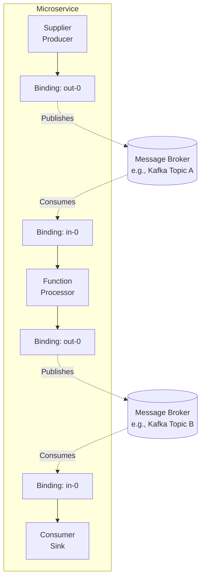
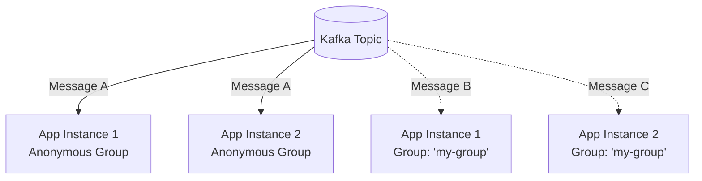

# Lesson 7: Spring Cloud Stream

**🎯 What you will learn:**

- The core concepts of Spring Cloud Stream: Binders, Bindings, and Messages.
- The modern functional programming model (`Supplier`, `Function`, `Consumer`).
- How to configure routing and consumer groups.
- Why legacy annotations like `@EnableBinding` are deprecated.

## Introduction

Spring Cloud Stream (SCS) is a framework for building highly scalable, event-driven microservices connected with shared messaging systems. It abstracts away the boilerplate of connecting to message brokers (like Kafka, RabbitMQ) and provides a highly opinionated, functional programming model for message processing.

## Architecture Guide

Spring Cloud Stream relies on a few core concepts:

- **Destination Binders:** Components responsible for providing integration with the external messaging systems.
- **Bindings:** The bridge between the external messaging systems and the application provided by the binder.
- **Message:** The canonical data structure used by developers to communicate with bindings.



## Detailed Guide

### 1. Setup and Dependencies

To use Spring Cloud Stream with Kafka, you need the Kafka binder.

**Maven:**

```xml
<dependency>
    <groupId>org.springframework.cloud</groupId>
    <artifactId>spring-cloud-stream-binder-kafka</artifactId>
</dependency>
```

### 2. Functional Programming Model

Modern Spring Cloud Stream uses standard Java 8 functional interfaces.

- `java.util.function.Supplier`: Acts as a Source (Producer).
- `java.util.function.Function`: Acts as a Processor (Consumes and Produces).
- `java.util.function.Consumer`: Acts as a Sink (Consumes only).

### 3. Example application

Let's build an application that produces data, processes it, and then consumes the result.

```java
import org.springframework.boot.SpringApplication;
import org.springframework.boot.autoconfigure.SpringBootApplication;
import org.springframework.context.annotation.Bean;

import java.util.function.Consumer;
import java.util.function.Function;
import java.util.function.Supplier;

@SpringBootApplication
public class CloudStreamApp {

    public static void main(String[] args) {
        SpringApplication.run(CloudStreamApp.class, args);
    }

    // 1. Supplier (Producer): Emits a greeting every second (by default)
    @Bean
    public Supplier<String> produceGreeting() {
        return () -> "Hello Cloud Stream";
    }

    // 2. Function (Processor): Takes a String, converts to Uppercase
    @Bean
    public Function<String, String> uppercase() {
        return value -> {
            System.out.println("Processing: " + value);
            return value.toUpperCase();
        };
    }

    // 3. Consumer (Sink): Consumes the final message
    @Bean
    public Consumer<String> consumeGreeting() {
        return value -> System.out.println("Consumed: " + value);
    }
}
```

### 4. Configuration (application.yml)

You must explicitly tell Spring Cloud Stream which functional beans to bind and configure their destinations (topics).

```yaml
spring:
  cloud:
    stream:
      function:
        definition: produceGreeting;uppercase;consumeGreeting # Define which functions to bind
      bindings:
        # Configuration for Supplier
        produceGreeting-out-0:
          destination: raw-greetings-topic

        # Configuration for Function
        uppercase-in-0:
          destination: raw-greetings-topic
          group: uppercase-processor-group
        uppercase-out-0:
          destination: processed-greetings-topic

        # Configuration for Consumer
        consumeGreeting-in-0:
          destination: processed-greetings-topic
          group: greeting-consumer-group
```

_Note the naming convention:_ `<functionName>-in-0` for inputs and `<functionName>-out-0` for outputs.

## Gotchas and Best Practices

### 1. Deprecated Legacy Annotations

**Gotcha:**

- Many older tutorials use `@EnableBinding`, `@StreamListener`, `Source.class`, and `Sink.class`. These have been deprecated for several years and will be removed.

**Fix:**

- Always use the functional programming model (`Supplier`, `Function`, `Consumer`) for new applications as shown above.

### 2. The Importance of Consumer Groups (`group`)

**Gotcha:**

- If you deploy multiple instances of your microservice and don't specify a `group` in your bindings, Spring Cloud Stream generates an anonymous, unique group ID for each instance. This results in the publish-subscribe pattern: every instance gets a copy of every message.



*Notice how instances without a shared group (App 1 and 2) both process the same message resulting in duplicate processing, while instances in the same group (App 1 and 2 with Group: 'my-group') properly load-balance the messages.*

**Fix:**

- To achieve the competing consumer pattern (load balancing messages across instances), always explicitly configure a `group` for your input bindings:

```yaml
spring.cloud.stream.bindings.myConsumer-in-0.group: my-service-group
```

### 3. Error Handling and Dead Letter Queues (DLQ)

**Gotcha:**

- Unhandled exceptions in your `Function` or `Consumer` will cause the message to be continually retried, potentially blocking the partition.

**Fix:**

- Configure a Dead Letter Queue (DLQ) to route failed messages aside for later inspection without blocking the main flow.

```yaml
spring:
  cloud:
    stream:
      kafka:
        bindings:
          uppercase-in-0:
            consumer:
              enableDlq: true
              dlqName: raw-greetings-dlq
```

### 4. Content Type Negotiation

**Gotcha:**

- Deserialization errors when reading from a topic populated by a non-Spring application.

**Fix:**

- Spring Cloud Stream defaults to JSON (`application/json`). If the incoming data is plain text or Avro, you must specify the content type on the binding:

```yaml
spring.cloud.stream.bindings.uppercase-in-0.content-type: text/plain
```

---

[← Lesson 6: Spring for Apache Kafka Streams](./0006-spring-kafka-streams.md) | [Lesson 8: Spring Cloud Bus →](./0008-spring-cloud-bus.md)
