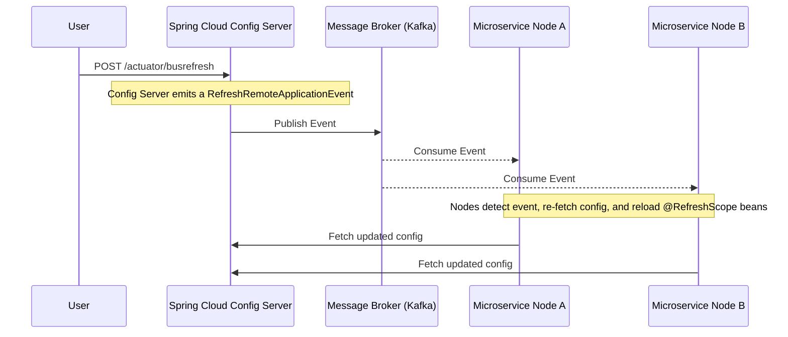
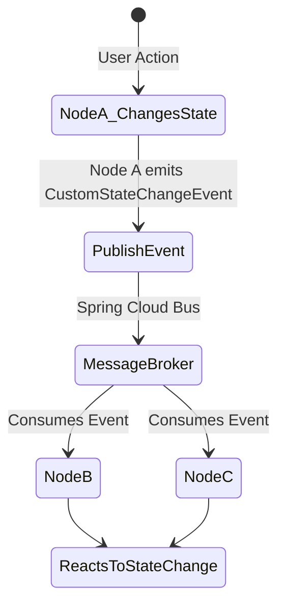

# Lesson 8: Spring Cloud Bus

**🎯 What you will learn:**

- How Spring Cloud Bus differs from Spring Cloud Stream.
- Using the Bus for control-plane tasks (like config refreshes).
- Creating and broadcasting custom events across your microservices.
- Key design patterns and anti-patterns for message bus systems.

## Introduction

Spring Cloud Bus links nodes of a distributed system with a lightweight message broker (like RabbitMQ or Kafka). It is primarily used to broadcast state changes (like configuration changes) or other management instructions across all connected instances of your microservices. It turns an application context into a distributed one.

Unlike Spring Cloud Stream, which is built for data processing pipelines, Spring Cloud Bus is built for control plane messaging.

## Architecture Guide

The most common use case for Spring Cloud Bus is broadcasting configuration refresh events. When a property changes in your Git repository backing the Spring Cloud Config Server, you want all instances to pick up the change without restarting.



## Detailed Guide

### 1. Setup and Dependencies

To enable Spring Cloud Bus backed by Kafka, you need the bus starter and the actuator starter.

**Maven:**

```xml
<dependency>
    <groupId>org.springframework.cloud</groupId>
    <artifactId>spring-cloud-starter-bus-kafka</artifactId>
</dependency>
<dependency>
    <groupId>org.springframework.boot</groupId>
    <artifactId>spring-boot-starter-actuator</artifactId>
</dependency>
```

### 2. Configuration

You need to expose the bus endpoints via Spring Boot Actuator and configure connection to the broker.

**application.yml:**

```yaml
spring:
  cloud:
    bus:
      enabled: true
      destination: springCloudBus # The Kafka topic used by the Bus (default is springCloudBus)
  kafka:
    bootstrap-servers: localhost:9092

management:
  endpoints:
    web:
      exposure:
        include: busrefresh, busenv # Expose the bus endpoints
```

### 3. Example: Dynamic Configuration Refresh

1.  Annotate beans that use `@Value` with `@RefreshScope`.

```java
import org.springframework.beans.factory.annotation.Value;
import org.springframework.cloud.context.config.annotation.RefreshScope;
import org.springframework.web.bind.annotation.GetMapping;
import org.springframework.web.bind.annotation.RestController;

@RestController
@RefreshScope // Critical for dynamic refresh
public class MessageController {

    @Value("${custom.message:Default Message}")
    private String message;

    @GetMapping("/message")
    public String getMessage() {
        return message;
    }
}
```

2.  Change the property `custom.message` in your central config repository.
3.  Trigger the refresh by sending a POST request to _any_ single node (or the Config Server itself) on the bus:
    `curl -X POST http://localhost:8080/actuator/busrefresh`
4.  The receiving node will broadcast the `RefreshRemoteApplicationEvent` to the broker, and all nodes on the bus will gracefully reload their `@RefreshScope` beans.

### 4. Custom Events

You can also use the Bus to broadcast your own custom events across the cluster.



```java
import org.springframework.cloud.bus.event.RemoteApplicationEvent;

// 1. Define the event
public class CustomStateChangeEvent extends RemoteApplicationEvent {
    private String stateData;

    // Required by Jackson for deserialization
    public CustomStateChangeEvent() { }

    public CustomStateChangeEvent(Object source, String originService, String destinationService, String stateData) {
        super(source, originService, destinationService);
        this.stateData = stateData;
    }

    public String getStateData() { return stateData; }
}
```

```java
import org.springframework.context.ApplicationEventPublisher;
import org.springframework.stereotype.Service;

// 2. Publish the event
@Service
public class StateService {
    private final ApplicationEventPublisher publisher;
    private final String serviceId; // e.g., injected via spring.application.name

    public StateService(ApplicationEventPublisher publisher, @Value("${spring.application.name}") String serviceId) {
        this.publisher = publisher;
        this.serviceId = serviceId;
    }

    public void triggerStateChange() {
        // Broadcast to all services ("**")
        CustomStateChangeEvent event = new CustomStateChangeEvent(this, serviceId, "**", "NEW_STATE_DETECTED");
        publisher.publishEvent(event);
    }
}
```

```java
import org.springframework.context.event.EventListener;
import org.springframework.stereotype.Component;

// 3. Consume the event on other nodes
@Component
public class StateChangeListener {

    @EventListener
    public void onCustomStateChange(CustomStateChangeEvent event) {
        System.out.println("Received state change from " + event.getOriginService() + ": " + event.getStateData());
    }
}
```

## Gotchas and Best Practices

### 1. Do Not Use for Data Transfer

**Gotcha:**

- Developers sometimes mistake Spring Cloud Bus for a general-purpose messaging system and try to send large data payloads (e.g., streaming user data) through it.

**Fix:**

- Spring Cloud Bus is designed strictly for _control plane_ messages (state changes, cache evictions, config refreshes).
- For data pipelines, use **Spring Cloud Stream** instead.

### 2. Addressing Specific Instances

**Gotcha:**

- Emitting an event broadcasts it to every single microservice on the bus, which might be unnecessary and noisy.

**Fix:**

- Use the `destinationService` parameter in `RemoteApplicationEvent`.

- `**`: All services (default)
- `customers:**`: All instances of the `customers` service
- `customers:customers-instance-1`: A specific instance

To target a specific app with `/actuator/busrefresh`, you can append the destination:
`curl -X POST http://localhost:8080/actuator/busrefresh/customers:**`

### 3. Broker Single Point of Failure

**Gotcha:**

- Because all nodes rely on the bus to receive critical management instructions (like config changes), the underlying broker (Kafka/RabbitMQ) becomes a single point of failure for the control plane.

**Fix:**

- Ensure your message broker is clustered and highly available.

### 4. Event Tracing

**Gotcha:**

- When multiple events are flying across the bus, it can be very difficult to debug which instance emitted an event and which instances successfully processed it.

**Fix:**

- Integrate Spring Cloud Sleuth or Micrometer Tracing. Spring Cloud Bus will propagate the trace context in the message headers, allowing you to trace the event across the cluster in tools like Zipkin or Jaeger.

---

[← Lesson 7: Spring Cloud Stream](./0007-spring-cloud-stream.md) | [Home →](../index.md)
